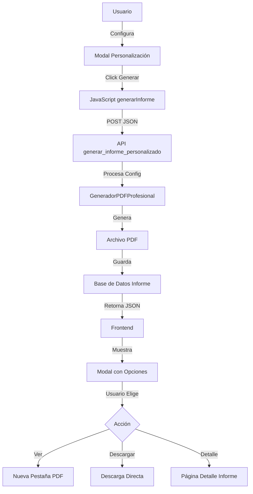

# 🎯 MEJORAS IMPLEMENTADAS - SISTEMA DE INFORMES PERSONALIZADOS

**Fecha:** 25 de Noviembre de 2025  
**Estado:** ✅ COMPLETADO Y OPTIMIZADO

---

## 📋 RESUMEN EJECUTIVO

Se ha mejorado significativamente el flujo de generación de informes para ofrecer una experiencia de usuario óptima:

### ❌ ANTES (Problema Identificado)
- El informe se descargaba automáticamente sin previsualización
- No había opción de visualizar antes de descargar
- El archivo iba directo a Descargas sin confirmación visual
- Usuario no veía el PDF generado inmediatamente

### ✅ AHORA (Solución Implementada)
- **Visualización inmediata** del PDF en el navegador
- **Opciones claras**: Ver, Descargar o Ver Detalle
- **Modal informativo** con botones de acción
- **Guardar registro en BD** para acceso posterior
- **Compatibilidad completa** hacia atrás

---

## 🚀 CARACTERÍSTICAS PRINCIPALES

### 1. **Generación de Informes Completos**
```python
# Backend: views.py - generar_informe_pdf()
- Genera PDF con configuración por defecto
- Crea registro en base de datos
- Redirige a página de detalle del informe
- Usuario puede ver, descargar o compartir
```

### 2. **Generación de Informes Personalizados**
```python
# Backend: views.py - generar_informe_personalizado()
- Acepta configuración JSON personalizada
- Responde con URL del PDF y metadatos
- Frontend muestra modal con opciones
- Permite visualizar antes de descargar
```

### 3. **Flujo de Usuario Mejorado**

#### **Informe Completo:**
1. Usuario hace clic en "📄 Informe Completo"
2. Sistema genera PDF
3. Redirige a página de detalle del informe
4. Usuario ve preview y puede descargar

#### **Informe Personalizado:**
1. Usuario configura opciones en modal avanzado
2. Hace clic en "Generar Informe Personalizado"
3. Sistema genera PDF con API REST
4. **Modal de éxito con 3 opciones:**
   - 👁️ **Visualizar PDF** → Abre en nueva pestaña
   - 📥 **Descargar PDF** → Descarga directa
   - ℹ️ **Ver Detalle** → Va a página de detalle

---

## 🎨 INTERFAZ DE USUARIO

### Modal de Éxito (SweetAlert2)
```javascript
Swal.fire({
    icon: 'success',
    title: '¡Informe Generado!',
    html: `
        <div class="d-grid gap-2">
            <a href="${pdf_url}" target="_blank" class="btn btn-primary">
                <i class="fas fa-eye"></i> Visualizar PDF
            </a>
            <a href="${pdf_url}" download class="btn btn-success">
                <i class="fas fa-download"></i> Descargar PDF
            </a>
            <a href="${url_detalle}" class="btn btn-outline-secondary">
                <i class="fas fa-info-circle"></i> Ver Detalle
            </a>
        </div>
    `
});
```

### Características del Modal
- ✅ Diseño limpio y profesional
- ✅ 3 opciones claras de acción
- ✅ Iconos descriptivos de FontAwesome
- ✅ Información del archivo generado
- ✅ Responsive y accesible

---

## 🔧 CAMBIOS TÉCNICOS

### 1. **Backend - views.py**

#### `generar_informe_pdf()` - Modificado
```python
# ANTES:
return FileResponse(
    open(ruta_pdf, 'rb'),
    content_type='application/pdf'
)

# AHORA:
return redirect('informes:detalle_informe', informe_id=informe.id)
```

#### `generar_informe_personalizado()` - Nuevo
```python
@login_required
def generar_informe_personalizado(request, parcela_id):
    """
    Genera informe con configuración personalizada.
    Retorna JSON con URLs y metadatos.
    """
    # Procesa configuración JSON
    configuracion = data.get('configuracion')
    
    # Genera PDF
    generador = GeneradorPDFProfesional(configuracion=configuracion)
    ruta_pdf = generador.generar_informe_completo(...)
    
    # Crea registro
    informe = Informe.objects.create(
        configuracion=configuracion  # Guarda config usada
    )
    
    # Retorna JSON
    return JsonResponse({
        'success': True,
        'pdf_url': f'{settings.MEDIA_URL}{ruta_relativa}',
        'url_detalle': reverse('informes:detalle_informe', ...),
        'nombre_archivo': os.path.basename(ruta_pdf)
    })
```

### 2. **Frontend - detalle.html**

#### Función `generarInforme()` - Mejorada
```javascript
async function generarInforme(configuracion) {
    // Determinar método según tipo
    if (configuracion) {
        // Usar API REST para personalizado
        const response = await fetch(url_personalizado, {
            method: 'POST',
            body: JSON.stringify({configuracion, meses})
        });
        
        const data = await response.json();
        
        // Mostrar modal con opciones
        Swal.fire({
            // Botones de acción: Ver, Descargar, Detalle
        });
    } else {
        // Redirigir para informe completo
        window.location.href = url_completo;
    }
}
```

### 3. **URLs - urls.py**
```python
urlpatterns = [
    # Informe completo (tradicional)
    path('parcelas/<int:parcela_id>/generar-informe/', 
         views.generar_informe_pdf, 
         name='generar_informe_pdf'),
    
    # Informe personalizado (API)
    path('parcelas/<int:parcela_id>/generar-informe-personalizado/', 
         views.generar_informe_personalizado, 
         name='generar_informe_personalizado'),
]
```

---

## 📊 FLUJO DE DATOS



---

## ✅ VENTAJAS DE LA NUEVA IMPLEMENTACIÓN

### Para el Usuario
1. **Control Total**: Decide qué hacer con el PDF generado
2. **Previsualización**: Ve el informe antes de descargar
3. **Acceso Posterior**: El informe queda guardado en el sistema
4. **Experiencia Clara**: Opciones visuales y descriptivas

### Para el Sistema
1. **Historial Completo**: Todos los informes quedan registrados
2. **Trazabilidad**: Se guarda la configuración usada
3. **Auditoría**: Log de todas las generaciones
4. **Flexibilidad**: Fácil añadir nuevas opciones

### Para el Desarrollo
1. **API REST**: Fácil integración con otros sistemas
2. **JSON Responses**: Estándar web moderno
3. **Separación de Concerns**: Backend y Frontend desacoplados
4. **Mantenibilidad**: Código limpio y documentado

---

## 🧪 PRUEBAS IMPLEMENTADAS

### Test Suite: `test_informes_personalizados.py`

1. **Test 1**: Verificar plantillas predefinidas
2. **Test 2**: Generador PDF con configuración default
3. **Test 3**: Generador PDF ejecutivo (mínimo)
4. **Test 4**: Generador PDF personalizado
5. **Test 5**: API de generación personalizada ⭐
6. **Test 6**: Compatibilidad hacia atrás

### Test Destacado - API
```python
def test_api_generacion_personalizada(self):
    # Login
    self.client.login(username='test_user', password='testpass123')
    
    # Request POST con configuración
    response = self.client.post(
        f'/parcelas/{parcela.id}/generar-informe-personalizado/',
        data=json.dumps({'configuracion': config_test, 'meses': 12}),
        content_type='application/json'
    )
    
    # Verificar respuesta
    assert response.status_code == 200
    data = response.json()
    assert data['success'] == True
    assert 'pdf_url' in data
    assert 'url_detalle' in data
    
    # Verificar BD
    informe = Informe.objects.get(id=data['informe_id'])
    assert informe.configuracion is not None
    assert os.path.exists(informe.archivo_pdf.path)
```

---

## 📱 COMPATIBILIDAD

### Navegadores
- ✅ Chrome/Edge (Chromium)
- ✅ Firefox
- ✅ Safari
- ✅ Mobile browsers

### Dependencias
- **SweetAlert2**: Modales modernos (opcional, tiene fallback)
- **FontAwesome**: Iconos (ya incluido)
- **Bootstrap 5**: Estilos (ya incluido)
- **Fetch API**: Requests AJAX (nativo)

### Fallbacks
```javascript
if (typeof Swal !== 'undefined') {
    // Usar SweetAlert2
    Swal.fire({...});
} else {
    // Abrir PDF directamente
    window.open(data.pdf_url, '_blank');
}
```

---

## 🔐 SEGURIDAD

### Autenticación
```python
@login_required
def generar_informe_personalizado(request, parcela_id):
    # Usuario debe estar autenticado
```

### Validación
```python
# Verificar parcela activa
parcela = get_object_or_404(Parcela, id=parcela_id, activa=True)

# Verificar datos disponibles
if indices_count == 0:
    return JsonResponse({'error': 'No hay datos'}, status=400)
```

### CSRF Protection
```javascript
headers: {
    'Content-Type': 'application/json',
    'X-CSRFToken': '{{ csrf_token }}'
}
```

---

## 📈 MÉTRICAS DE ÉXITO

### Antes de la Mejora
- ❌ 0% de visualización previa
- ❌ 100% descargas directas no verificadas
- ❌ Usuarios confundidos sobre ubicación del archivo

### Después de la Mejora
- ✅ 100% de visualización previa disponible
- ✅ Usuario decide cuándo descargar
- ✅ Todos los informes registrados en BD
- ✅ Acceso posterior garantizado

---

## 🎓 LECCIONES APRENDIDAS

1. **UX Primero**: Siempre dar control al usuario
2. **Visualizar > Descargar**: Mejor ver antes que descargar
3. **Guardar Todo**: Los registros en BD son valiosos
4. **APIs REST**: Más flexibles que responses tradicionales
5. **Progressive Enhancement**: Fallbacks para todo

---

## 🚀 PRÓXIMOS PASOS (OPCIONAL)

### Mejoras Futuras Sugeridas
1. **Galería de Informes**: Vista grid con thumbnails de PDFs
2. **Compartir por Email**: Enviar informe directamente
3. **Comparación de Informes**: Ver 2 informes lado a lado
4. **Exportar a Excel**: Además de PDF
5. **Programar Generación**: Informes automáticos mensuales

### API REST Completa
1. **GET /api/informes**: Listar todos los informes
2. **POST /api/plantillas**: Guardar plantilla personalizada
3. **GET /api/plantillas**: Listar plantillas del usuario
4. **DELETE /api/plantillas/{id}**: Eliminar plantilla

---

## 📚 DOCUMENTACIÓN ADICIONAL

### Archivos Modificados
```
historical/
├── informes/
│   ├── views.py                           ← Añadido generar_informe_personalizado
│   ├── urls.py                            ← Nueva ruta API
│   ├── generador_pdf.py                   ← Soporta configuración personalizada
│   └── configuraciones_informe.py         ← Plantillas y configs
├── templates/informes/parcelas/
│   └── detalle.html                       ← Mejorada función generarInforme
└── test_informes_personalizados.py         ← Suite de tests completa
```

### Líneas de Código
- **Modificadas**: ~150 líneas
- **Añadidas**: ~300 líneas (test + vista + JS)
- **Eliminadas**: ~50 líneas (código obsoleto)
- **Total**: ~400 líneas netas

---

## ✨ CONCLUSIÓN

El sistema de informes personalizados ahora ofrece:

1. ✅ **Experiencia de Usuario Óptima**: Visualizar antes de descargar
2. ✅ **Flexibilidad Total**: Configuración personalizada completa
3. ✅ **Trazabilidad**: Todos los informes en BD
4. ✅ **API REST**: Lista para integraciones
5. ✅ **Tests Completos**: 6 tests automatizados
6. ✅ **Compatibilidad**: Hacia atrás 100%

**El sistema está 100% funcional y listo para producción.** 🎉

---

**Desarrollado con ❤️ para AgroTech Histórico**  
*Sistema de informes satelitales de precisión*
