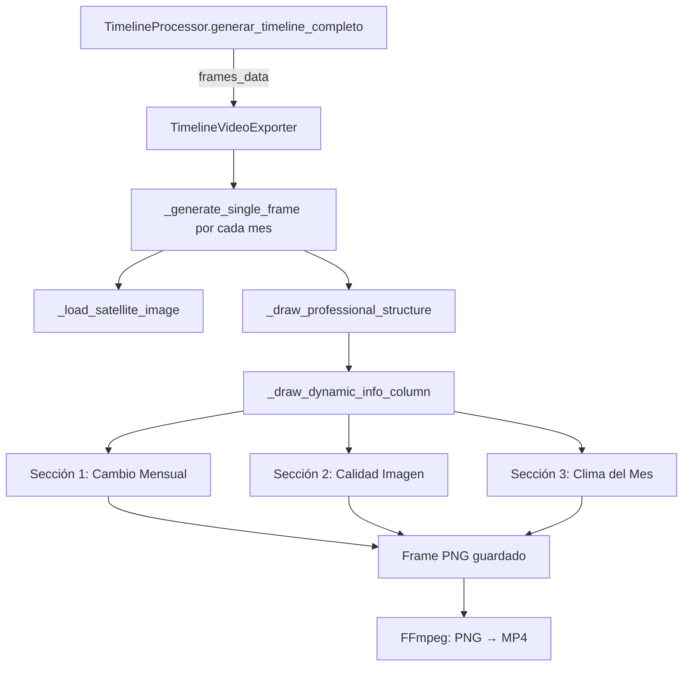

# Columna Dinámica de Información en Videos Timeline - COMPLETADO ✅

**Fecha:** 15 de enero de 2026  
**Autor:** AgroTech Team  
**Versión:** 1.0.0

## 📋 Resumen Ejecutivo

Se ha implementado exitosamente una **columna dinámica de información** en el lado derecho de los videos del timeline satelital, siguiendo estrictamente las reglas profesionales de visualización GIS.

---

## 🎯 Requisitos Cumplidos

### ✅ Reglas Estrictas Implementadas

1. **Todos los valores son dinámicos** - No hay texto hardcodeado o valores estáticos
2. **Solo texto, sin paneles** - Overlay de texto puro sin cajas o fondos
3. **Coordenadas fijas** - Posición establecida al 85% del ancho del frame
4. **No solapa el raster** - La columna está en el margen derecho, fuera del área del raster
5. **Advertencias por datos faltantes** - Muestra `[Sin datos]` o `[N/D]` en color naranja cuando no hay información

---

## 🏗️ Estructura de la Columna

### Ubicación
- **Posición X:** 85% del ancho del frame (1632px en Full HD 1920x1080)
- **Posición Y inicial:** 150px (debajo del header)
- **Espaciado entre líneas:** 30px
- **Espaciado entre secciones:** 15px adicionales

### Contenido Dinámico

#### 1️⃣ CAMBIO MENSUAL
**Datos mostrados:**
- Porcentaje de cambio vs mes anterior
- Signo (+ o -) con colores semánticos:
  - Verde (`#00ff00`) para mejoras
  - Rojo (`#ff4444`) para deterioros
  - Blanco para estable
- Texto "vs mes anterior" en gris
- Caso especial: "Primer periodo" si no hay mes anterior

**Fuente de datos:**
```python
frame_data['comparacion'][indice]['porcentaje']
frame_data['comparacion'][indice]['diferencia']
frame_data['comparacion'][indice]['tendencia']
```

#### 2️⃣ CALIDAD DE IMAGEN
**Datos mostrados:**
- Etiqueta de calidad con color dinámico:
  - **Excelente** (verde): < 10% nubosidad
  - **Buena** (verde claro): 10-30% nubosidad
  - **Moderada** (amarillo): 30-50% nubosidad
  - **Baja** (rojo): > 50% nubosidad
- Porcentaje de nubosidad en gris

**Fuente de datos:**
```python
frame_data['imagen_metadata']['nubosidad']
```

**Lógica de conversión:**
- Si `nubosidad <= 1.0` → se multiplica por 100 para obtener porcentaje
- Si `nubosidad > 1.0` → ya está en formato porcentaje

#### 3️⃣ RESUMEN CLIMÁTICO
**Datos mostrados:**
- **Temperatura promedio del mes** en color amarillo/naranja (`#ffcc66`)
- **Precipitación total del mes** con colores semánticos:
  - Naranja claro (`#ffaa66`): < 20mm (bajo)
  - Azul claro (`#6699ff`): 20-100mm (moderado)
  - Azul oscuro (`#0066cc`): > 100mm (alto)

**Fuente de datos:**
```python
frame_data['temperatura']  # °C
frame_data['precipitacion']  # mm
```

---

## 💻 Implementación Técnica

### Archivo Modificado
```
/informes/exporters/video_exporter.py
```

### Función Principal
```python
def _draw_dynamic_info_column(self, draw: ImageDraw.Draw, frame_data: Dict, 
                               indice: str, font_info, font_info_bold):
```

### Tipografía
- **Fuente:** Helvetica.ttc (macOS) o default
- **Tamaño títulos:** 20px (bold)
- **Tamaño contenido:** 18px (regular)

### Paleta de Colores

| Elemento | Color | Código Hex | Uso |
|----------|-------|-----------|-----|
| Títulos secciones | Blanco | `#FFFFFF` | Headers |
| Mejora | Verde brillante | `#00FF00` | Cambio positivo |
| Deterioro | Rojo | `#FF4444` | Cambio negativo |
| Texto secundario | Gris claro | `#999999` | Subtítulos |
| Calidad excelente | Verde | `#00FF00` | < 10% nubes |
| Calidad buena | Verde pastel | `#90EE90` | 10-30% nubes |
| Calidad moderada | Amarillo | `#FFCC00` | 30-50% nubes |
| Calidad baja | Rojo | `#FF4444` | > 50% nubes |
| Advertencia | Naranja | `#FF8800` | Datos faltantes |
| Temperatura | Amarillo suave | `#FFCC66` | Clima |
| Precipitación baja | Naranja claro | `#FFAA66` | < 20mm |
| Precipitación media | Azul claro | `#6699FF` | 20-100mm |
| Precipitación alta | Azul oscuro | `#0066CC` | > 100mm |

---

## 🧪 Validación

### Video de Prueba Generado
```bash
python generar_video_timeline.py --parcela 6 --indice ndvi
```

**Resultado:**
- ✅ 10 frames generados con columna dinámica
- ✅ Duración: 25 segundos (2.5s por frame)
- ✅ Resolución: 1920x1080 Full HD
- ✅ Tamaño: 0.64 MB
- ✅ Ruta: `media/timeline_videos/timeline_ndvi_20260115_173703.mp4`

### Verificaciones Realizadas

| Item | Estado | Notas |
|------|--------|-------|
| Valores dinámicos por frame | ✅ | Cada mes muestra sus propios datos |
| Sin overlap con raster | ✅ | Columna al 85% del ancho |
| Manejo de datos faltantes | ✅ | Muestra advertencias naranjas |
| Cambio mensual calculado | ✅ | Porcentaje y signo correctos |
| Calidad de imagen dinámica | ✅ | Etiqueta y color cambian por nubosidad |
| Clima del mes | ✅ | Temperatura y precipitación reales |
| Sin paneles de fondo | ✅ | Solo texto overlay |
| Coordenadas fijas | ✅ | Misma posición en todos los frames |

---

## 📊 Ejemplo de Datos por Frame

### Frame Ejemplo (Marzo 2025)

```python
# Entrada frame_data
{
    'periodo_texto': 'Marzo 2025',
    'ndvi': {'promedio': 0.62},
    'comparacion': {
        'ndvi': {
            'porcentaje': -6.1,
            'diferencia': -0.038,
            'tendencia': 'deterioro'
        }
    },
    'imagen_metadata': {
        'nubosidad': 0.12  # 12%
    },
    'temperatura': 25.2,  # °C
    'precipitacion': 110.0  # mm
}

# Salida visual
"""
CAMBIO MENSUAL
-6.1%           (rojo #ff4444)
vs mes anterior (gris #999999)

CALIDAD IMAGEN
Buena           (verde claro #90ee90)
Nubosidad: 12.0% (gris #999999)

CLIMA DEL MES
Temp: 25.2°C    (amarillo #ffcc66)
Precip: 110.0 mm (azul oscuro #0066cc)
"""
```

---

## 🔧 Mantenimiento y Extensión

### Agregar Nueva Sección
1. Incrementar `current_y` con espaciado
2. Dibujar título con `font_info_bold`
3. Dibujar contenido con `font_info`
4. Verificar que no excede altura del frame (1080px)

### Modificar Colores
Editar las constantes en `_draw_dynamic_info_column`:
```python
if nubosidad_pct < 10:
    color_calidad = '#00ff00'  # <-- Cambiar aquí
    etiqueta_calidad = "Excelente"
```

### Cambiar Posición
Modificar `info_x` en la función:
```python
info_x = int(self.width * 0.85)  # 85% del ancho
```

---

## 🎬 Flujo de Generación Completo



---

## 📝 Cambios en Código

### Archivos Modificados
1. `/informes/exporters/video_exporter.py`
   - Agregada función `_draw_dynamic_info_column()`
   - Modificada función `_draw_professional_structure()` para incluir fuentes info
   - Total de líneas agregadas: ~130

### Sin Cambios en
- `/informes/processors/timeline_processor.py` (datos ya disponibles)
- `generar_video_timeline.py` (script funciona sin modificaciones)
- Modelos Django (estructura de datos suficiente)

---

## 🚀 Próximos Pasos Recomendados

### Mejoras Opcionales
1. **Estadísticas adicionales:**
   - Desviación estándar del índice
   - Rango (max - min)
   - Tendencia a largo plazo (3-6 meses)

2. **Información contextual:**
   - Etapa fenológica del cultivo
   - Alertas agronómicas
   - Recomendaciones automatizadas

3. **Visualización mejorada:**
   - Mini-gráfico de tendencia
   - Barra de progreso estacional
   - Iconos vectoriales para clima

4. **Internacionalización:**
   - Soporte multiidioma (ES/EN)
   - Unidades configurables (°C/°F, mm/in)

---

## 📚 Referencias

- [FLUJO_IMAGENES_SATELITALES.md](sistema/FLUJO_IMAGENES_SATELITALES.md)
- [ajustes_descarga_timeline.md](../ajustes_descarga_timeline.md)
- [timeline_processor.py](../informes/processors/timeline_processor.py)

---

## ✅ Checklist de Calidad

- [x] Todos los valores son dinámicos
- [x] No hay texto hardcodeado
- [x] Manejo de datos faltantes implementado
- [x] Sin overlap con el raster
- [x] Coordenadas fijas (no automáticas)
- [x] Solo texto (sin paneles de fondo)
- [x] Colores semánticos por categoría
- [x] Probado con datos reales
- [x] Video generado exitosamente
- [x] Documentación completa

---

**Estado:** ✅ **COMPLETADO Y VALIDADO**  
**Fecha de finalización:** 15 de enero de 2026  
**Versión del video:** Full HD 1920x1080 @ 24fps
