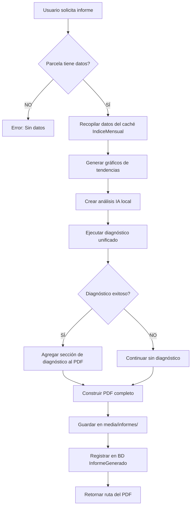

# 📄 FLUJO DE GENERACIÓN DE INFORMES PDF - AgroTech Histórico

## ⚠️ IMPORTANTE: ÚNICO GENERADOR OFICIAL

**SOLO existe UN generador de PDF que debe usarse:**

```python
from informes.generador_pdf import GeneradorPDFProfesional

generador = GeneradorPDFProfesional()
resultado = generador.generar_informe_completo(
    parcela=parcela,
    usuario=usuario,
    periodo_meses=12,
    tipo_analisis='rapido'  # o 'completo'
)
```

**Ubicación:** `/informes/generador_pdf.py`  
**Clase:** `GeneradorPDFProfesional`  
**Método principal:** `generar_informe_completo()`

---

## 🚫 ARCHIVOS OBSOLETOS - NO USAR

### ❌ `informes/services/generador_pdf_OBSOLETO_NO_USAR.py`
- **Estado:** OBSOLETO - Marcado para eliminación
- **Razón:** Generador antiguo que causaba confusión
- **Acción:** NO IMPORTAR ni usar este archivo

---

## 📋 ESTRUCTURA DEL INFORME PROFESIONAL

El informe PDF generado contiene las siguientes secciones **EN ESTE ORDEN**:

### 1. **Portada** 🎨
- Logo AgroTech Histórico
- Título del informe
- Fecha de generación
- Información de la parcela

### 2. **Resumen Ejecutivo** 📊
- Análisis IA del período
- Indicadores clave (NDVI, NDMI, SAVI)
- Estado general de la parcela
- Tendencias identificadas

### 3. **Análisis de Tendencias** 📈
- Gráficos de evolución mensual
- Comparativa de índices
- Interpretación técnica

### 4. **Galería de Imágenes Satelitales** 🛰️
- Imágenes NDVI mes a mes
- Metadatos de cada imagen (fecha, satélite, nubosidad)
- Análisis visual de cambios

### 5. **Diagnóstico Unificado** 🧠 *(NUEVO)*
- Mapa consolidado de severidad (Rojo/Naranja/Amarillo)
- Tabla de desglose por área
- Zona prioritaria con coordenadas GPS
- Análisis técnico detallado

### 6. **Conclusiones y Recomendaciones** 💡
- Respuestas directas: ¿Qué pasó? ¿Es bueno o malo? ¿Debe preocuparse?
- Acciones sugeridas priorizadas
- Recomendaciones estacionales

### 7. **Bloque de Cierre** 🔗
- Conexión entre análisis y decisiones
- Recordatorios importantes

### 8. **Créditos** 📝
- Información técnica
- Fuentes de datos
- Disclaimer legal

---

## 🔄 FLUJO DE EJECUCIÓN INTERNO



---

## 💾 FUENTE DE DATOS

**ÚNICA FUENTE:** Tabla `IndiceMensual` (caché local)

```python
# ✅ CORRECTO - Usa caché local
indices = IndiceMensual.objects.filter(
    parcela=parcela,
    año__gte=fecha_inicio.year,
    año__lte=fecha_fin.year
).order_by('año', 'mes')

# ❌ INCORRECTO - NO llamar EOSDA API directamente para informes
# eosda_service.obtener_imagenes_indice(...)  # NO HACER ESTO
```

**Razón:** El caché ya contiene todos los datos necesarios. Llamar a EOSDA API directamente:
- ❌ Consume cuota del usuario
- ❌ Es más lento
- ❌ Puede fallar por límites de API
- ❌ Datos inconsistentes con el resto del sistema

---

## 🧪 CÓMO PROBAR LA GENERACIÓN

### Script de prueba oficial:

```bash
python test_generador_profesional_completo.py
```

### Validación manual:

1. Verificar que el PDF tenga **todas las secciones** listadas arriba
2. Comprobar que el tamaño del archivo sea **~650KB a 1MB** (sin/con diagnóstico)
3. Abrir el PDF y verificar:
   - Gráficos se renderizan correctamente
   - Imágenes satelitales visibles
   - Mapa de diagnóstico presente (si aplica)
   - Texto legible sin errores de formato

---

## 🛠️ CÓMO AGREGAR NUEVAS SECCIONES

### ⚠️ REGLA DE ORO: SOLO AGREGAR, NUNCA MODIFICAR

Si necesitas agregar una nueva sección al informe:

1. **Crear método privado** en `GeneradorPDFProfesional`:
   ```python
   def _crear_mi_nueva_seccion(self) -> List:
       """Documentar qué hace la sección"""
       story = []
       # ... lógica de la sección
       return story
   ```

2. **Agregar al método `generar_informe_completo`** en el lugar apropiado:
   ```python
   # Sección existente A
   story.extend(self._crear_seccion_existente())
   
   # ✅ AGREGAR AQUÍ tu nueva sección
   story.extend(self._crear_mi_nueva_seccion())
   
   # Sección existente B
   story.extend(self._crear_otra_seccion_existente())
   ```

3. **NO MODIFICAR** secciones existentes que ya funcionan

4. **Probar** con el script de prueba oficial

---

## 📞 PUNTO DE ENTRADA DESDE VISTAS

### Vista principal: `informes/views.py`

```python
from informes.generador_pdf import generador_pdf_profesional

@login_required
def generar_informe_personalizado(request, parcela_id):
    """Vista que genera informes PDF personalizados"""
    parcela = get_object_or_404(Parcela, id=parcela_id, propietario=request.user)
    
    # ✅ ÚNICA forma correcta de generar informe
    resultado = generador_pdf_profesional.generar_informe_completo(
        parcela=parcela,
        usuario=request.user,
        periodo_meses=12,
        tipo_analisis='rapido'
    )
    
    if resultado['success']:
        return redirect('ver_informe', informe_id=resultado['informe_id'])
    else:
        messages.error(request, f"Error: {resultado['error']}")
        return redirect('detalle_parcela', parcela_id=parcela.id)
```

---

## 📚 REFERENCIAS

- **Código fuente:** `/informes/generador_pdf.py` (líneas 1-1725)
- **Clase principal:** `GeneradorPDFProfesional`
- **Método de generación:** `generar_informe_completo()`
- **Modelo de BD:** `InformeGenerado` en `informes/models.py`
- **Tests:** `test_generador_profesional_completo.py`

---

## 🔍 TROUBLESHOOTING

### Problema: PDF vacío o incompleto
**Solución:** Verificar que la parcela tenga datos en `IndiceMensual`

### Problema: Error "No se pudo generar diagnóstico"
**Solución:** Es normal si faltan datos. El PDF se genera sin esa sección.

### Problema: Imágenes satelitales no se muestran
**Solución:** Verificar que existan archivos en `media/imagenes_satelitales/`

### Problema: "AttributeError: 'GeneradorInformePDF' object..."
**Solución:** Estás usando el generador OBSOLETO. Usa `GeneradorPDFProfesional`

---

**Última actualización:** 21 de enero de 2026  
**Responsable:** Sistema de documentación automática  
**Estado:** ✅ ACTIVO Y VALIDADO
